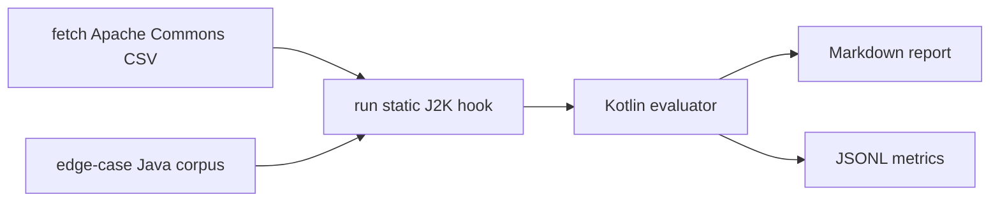

# Agentic Java2Kotlin Eval Pipeline

This repo is a Java-to-Kotlin conversion evaluation harness for the JetBrains internship task. It uses Apache Commons CSV as the real-world benchmark target instead of spring-petclinic, and it includes a hand-written edge-case corpus for converter stress tests.

The evaluator is written in Kotlin. It scores converted Kotlin output against Java source files, checks fixture hypotheses, optionally compiles Kotlin files with `kotlinc`, and writes Markdown plus JSONL results.

## What This Pipeline Does



The static J2K converter is the hard boundary. IntelliJ IDEA exposes the converter through IDE internals, not a stable public CLI. The repo therefore keeps conversion as an explicit hook:

```bash
J2K_RUNNER_CMD="/path/to/headless-j2k --input {input} --output {output}" \
  bash scripts/run-static-j2k.sh edge-cases/java build/edge-static-j2k
```

CI runs the Kotlin evaluator and fetches the real-world Apache Commons CSV source. If the repository variable `J2K_RUNNER_CMD` is configured, CI also runs the static converter hook against Apache Commons CSV and evaluates the output. The committed `fixtures/edge-static-j2k` directory gives the evaluator a reproducible corpus for tests and reports when the headless converter command is not available.

## Why Apache Commons CSV

I did not use spring-petclinic as the primary benchmark. Apache Commons CSV is a small but real Java library with parsing logic, builders, enums, package-private helpers, exceptions, and API compatibility constraints. It is easier to inspect than a large framework repo, but still more realistic than toy snippets.

Pinned source:

```bash
git clone --depth 1 --branch rel/commons-csv-1.14.1 https://github.com/apache/commons-csv.git work/commons-csv
```

## Run Locally

On Windows, use Java 21. On my machine I used IntelliJ's bundled JBR:

```powershell
$env:JAVA_HOME='C:\Program Files\JetBrains\IntelliJ IDEA 2025.3.1.1\jbr'
$env:PATH="$env:JAVA_HOME\bin;$env:PATH"
.\gradlew.bat test
.\gradlew.bat run --args="--java edge-cases/java --kotlin fixtures/edge-static-j2k --expectations edge-cases/expectations.txt --report reports/EDGE_CASE_RESULTS.md --jsonl reports/edge-case-results.jsonl --isolated-compile"
```

On Linux/macOS:

```bash
./gradlew test
bash scripts/run-edge-eval.sh
```

Fetch the real-world benchmark source:

```bash
bash scripts/fetch-benchmark.sh
```

Run the evaluator on a converted repo after static J2K output exists:

```bash
./gradlew run --args="--java work/commons-csv/src/main/java --kotlin build/commons-csv-j2k --report reports/COMMONS_CSV.md --jsonl reports/commons-csv.jsonl"
```

## Current Results

Edge corpus, committed static-style outputs:

| Metric | Value |
|---|---:|
| Java files | 6 |
| Kotlin files found | 6 |
| Isolated compile passed | 4 / 6 |
| Hypothesis checks passed | 7 / 7 |
| Unsafe markers | 0 |

The two compile failures are the interesting part:

- `try-with-resources/Sample.kt` exposes a nullable `BufferedReader.readLine()` return where the Java method promised `String`.
- `framework-annotations/Sample.kt` shows that annotation-heavy examples need module-level context, not isolated per-file compilation.

Real-world benchmark source scan:

| Benchmark | Java files | Converted files in repo |
|---|---:|---:|
| Apache Commons CSV 1.14.1 | 12 | 0 |

The conversion hook is present, but I did not claim a full Commons CSV conversion run without a working headless static-J2K runner.

## Reports

- `reports/EDGE_CASE_RESULTS.md`
- `reports/COMMONS_CSV_SOURCE_SCAN.md`
- `edge-cases/HYPOTHESES.md`
- `SUMMARY.md`
- `EDGE_CASE_REPORT.md`

## Proposed Fix

The `try-with-resources` case found a concrete nullability failure. I added `ReadLineNullabilityFix` as a tiny Kotlin post-processing rule:

```kotlin
return reader.readLine()
```

becomes:

```kotlin
return reader.readLine() ?: ""
```

That is not a universal fix for every API, but it demonstrates the post-processing shape: detect a specific unsafe conversion, rewrite it, and re-run the evaluator.

## Honest Scope

The evaluator is complete and runs in CI. The static J2K hook is wired but depends on a headless IntelliJ runner because the converter is not exposed as a stable command-line tool. I chose to make that boundary explicit instead of hiding it behind a fake converter.
