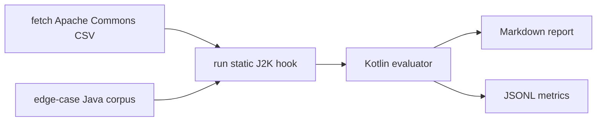

# Agentic Java2Kotlin Eval Pipeline

This repo is a Java-to-Kotlin conversion evaluation harness for the JetBrains internship task. It uses Apache Commons CSV as the real-world benchmark target instead of spring-petclinic, and it includes a hand-written edge-case corpus for converter stress tests.

The evaluator is written in Kotlin. It scores converted Kotlin output against Java source files, checks fixture hypotheses, optionally compiles Kotlin files with `kotlinc`, and writes Markdown plus JSONL results.

## What This Pipeline Does



The static J2K converter is the hard boundary. IntelliJ IDEA exposes the converter through IDE internals, not a stable public CLI. This repo includes an IntelliJ Platform runner module:

```text
runner/src/main/kotlin/j2k/runner/J2KStarter.kt
```

The runner registers an `ApplicationStarter` named `j2k`, opens a temporary IntelliJ project, attaches a JDK and Java source root, waits for smart mode, then calls `NewJavaToKotlinConverter.elementsToKotlin`.

To run it locally:

```bash
bash scripts/run-static-j2k.sh edge-cases/java build/edge-static-j2k
```

CI builds and validates the runner module, runs the Kotlin evaluator, fetches Apache Commons CSV, and checks the committed reports produced from live static-J2K output. I do not run `runIde` inside GitHub Actions because the IntelliJ sandbox can hang under headless Linux even when the same runner completes locally.

## Why Apache Commons CSV

I did not use spring-petclinic as the primary benchmark. Apache Commons CSV is a small but real Java library with parsing logic, builders, enums, package-private helpers, exceptions, and API compatibility constraints. It is easier to inspect than a large framework repo, but still more realistic than toy snippets.

Pinned source:

```bash
git clone --depth 1 --branch rel/commons-csv-1.14.1 https://github.com/apache/commons-csv.git work/commons-csv
```

## Run Locally

On Windows, use Java 21. On my machine I used IntelliJ's bundled JBR:

```powershell
$env:JAVA_HOME='C:\Program Files\JetBrains\IntelliJ IDEA 2025.3.1.1\jbr'
$env:PATH="$env:JAVA_HOME\bin;$env:PATH"
.\gradlew.bat test
.\gradlew.bat run --args="--java edge-cases/java --kotlin fixtures/edge-static-j2k --expectations edge-cases/expectations.txt --report reports/EDGE_CASE_RESULTS.md --jsonl reports/edge-case-results.jsonl --isolated-compile"
```

On Linux/macOS:

```bash
./gradlew test
bash scripts/run-edge-eval.sh
```

Fetch the real-world benchmark source:

```bash
bash scripts/fetch-benchmark.sh
```

Run static J2K on the real-world benchmark:

```bash
bash scripts/run-static-j2k.sh work/commons-csv/src/main/java build/commons-csv-j2k
```

Run the evaluator on a converted repo after static J2K output exists:

```bash
./gradlew run --args="--java work/commons-csv/src/main/java --kotlin build/commons-csv-j2k --report reports/COMMONS_CSV.md --jsonl reports/commons-csv.jsonl"
```

## Current Results

Edge corpus, committed static-style outputs:

| Metric | Value |
|---|---:|
| Java files | 6 |
| Kotlin files found | 6 |
| Isolated compile passed | 4 / 6 |
| Hypothesis checks passed | 7 / 7 |
| Unsafe markers | 0 |

The two compile failures are the interesting part:

- `try-with-resources/Sample.kt` exposes a nullable `BufferedReader.readLine()` return where the Java method promised `String`.
- `framework-annotations/Sample.kt` shows that annotation-heavy examples need module-level context, not isolated per-file compilation.

Real-world benchmark static J2K run:

| Benchmark | Java files | Converted Kotlin files | Unsafe markers |
|---|---:|---:|---:|
| Apache Commons CSV 1.14.1 | 12 | 12 | 0 |

This run was produced locally with the bundled IntelliJ runner. It is a structural evaluation, not a claim that Apache Commons CSV is now a production-ready Kotlin port. The next bar would be module-level compilation with the original project dependencies.

## Reports

- `reports/EDGE_CASE_RESULTS.md`
- `reports/EDGE_CASE_LIVE_J2K.md`
- `reports/COMMONS_CSV.md`
- `reports/COMMONS_CSV_SOURCE_SCAN.md`
- `edge-cases/HYPOTHESES.md`
- `SUMMARY.md`
- `EDGE_CASE_REPORT.md`
- `HEADLESS_J2K.md`

## Proposed Fix

The `try-with-resources` case found a concrete nullability failure. I added `ReadLineNullabilityFix` as a tiny Kotlin post-processing rule:

```kotlin
return reader.readLine()
```

becomes:

```kotlin
return reader.readLine() ?: ""
```

That is not a universal fix for every API, but it demonstrates the post-processing shape: detect a specific unsafe conversion, rewrite it, and re-run the evaluator.

## Scope

The evaluator and runner build run in CI. The live `runIde` conversion command is documented and was verified locally, but CI uses committed generated reports because the IntelliJ sandbox may hang under headless Linux. The runner uses IntelliJ Platform internals because the converter is not exposed as a stable standalone command-line tool.
